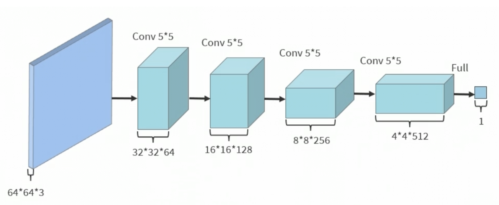

# Garfield Comic Generation using DCGAN

A student research project on using Deep Convolutional Generative Adversarial Networks (DCGAN) to generate new Garfield-style comic strips.


## Project Overview

This project explores the application of Generative Adversarial Networks (GANs), particularly the DCGAN architecture, to generate new 3-panel comics in the visual style of the *Garfield* series. It was developed as part of the Scientific Student Communication Session at the Faculty of Automatic Control and Computers, University POLITEHNICA of Bucharest.

## Inspiration

Inspired by the [Avant-Garfield](https://github.com/HackerPoet/Avant-Garfield) project and the CodeParade YouTube video, this implementation focuses on:

- Understanding how GANs can mimic the stylistic elements of comics
- Building my own working, stable and trainable PyTorch GAN pipeline
- Exploring the creative capabilities and limitations of AI-generated art

## Why Garfield?

Garfield comics are ideal for GAN training due to:

- Consistent format: 3 panels, regular characters, fixed layouts  
- Distinct visual style: repetitive color schemes and character poses  
- Large dataset: over 17,000 strips published and available online

## Architecture Overview

This project uses a classic DCGAN approach:

**Generator:**

- Takes a 100-dimensional noise vector
- Outputs a 64×64 RGB image
- Uses `ConvTranspose2d`, `BatchNorm2d`, `ReLU`, and `Tanh`


**Discriminator:**

- Classifies real vs. generated images
- Uses `Conv2d`, `BatchNorm2d`, `LeakyReLU`, and `Sigmoid`



## Technologies and Libraries

- Python
- [PyTorch](https://pytorch.org/)
- Torchvision
- Pillow (PIL)
- NumPy
- Matplotlib
- TQDM

## How It Works

### 1. Data Collection

- Web scraped comics from [pt.jikos.cz/garfield](http://pt.jikos.cz/garfield)
- Filtered for 3-panel formats only

### 2. Preprocessing

- Panels extracted and resized to 64×64 RGB
- Stored in `ImageFolder`-compatible structure for PyTorch

### 3. Training

- 100 epochs, using Binary Cross Entropy loss and Adam optimizers
- Tracked Generator and Discriminator losses across training


### 4. Generation

- Trained model is saved to `generator.pth`
- Use `Testing.ipynb` to generate new comics from random noise

## Results

Generated comics capture:

- Character shapes  
- Color patterns  
- Layout consistency

Limitations:

- Blurry details  
- Unreadable speech bubbles  
- Illogical or deformed scenes


## Training Stability

GAN training involved balancing generator/discriminator performance. Issues like instability were visible in the loss curves:


## Usage

After training:

```bash
# Load trained generator and generate images
python generate_comics.py
